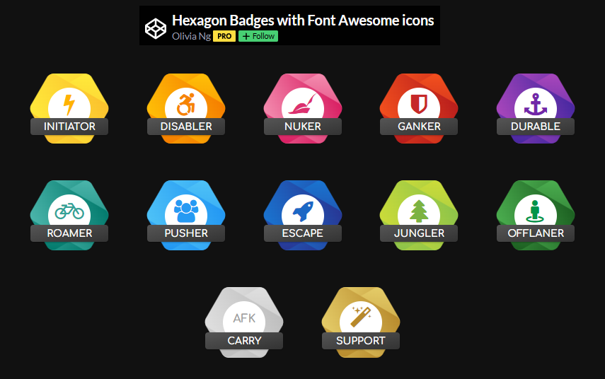

# Achievement Unlocked

This is a simple Node library to help generate and/or render achievement badges. It's inspired by the CodePen [*Hexagon Badges with Font Awesome icons*](https://codepen.io/oliviale/pen/qpPByV) by [Olivia Ng](https://codepen.io/oliviale/).

